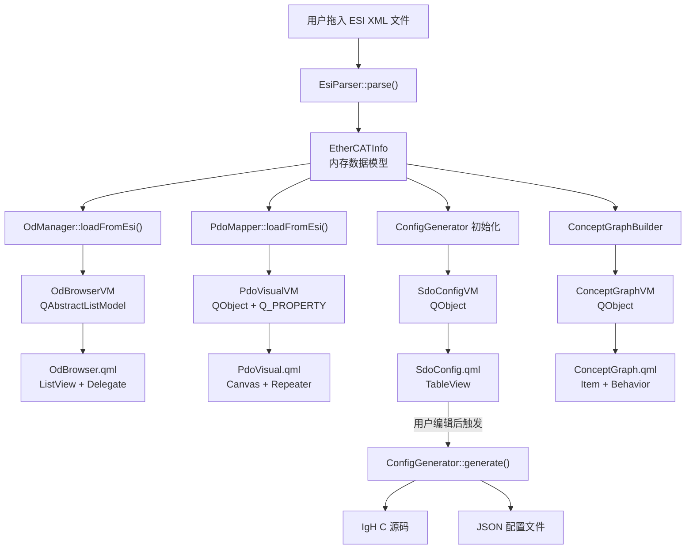
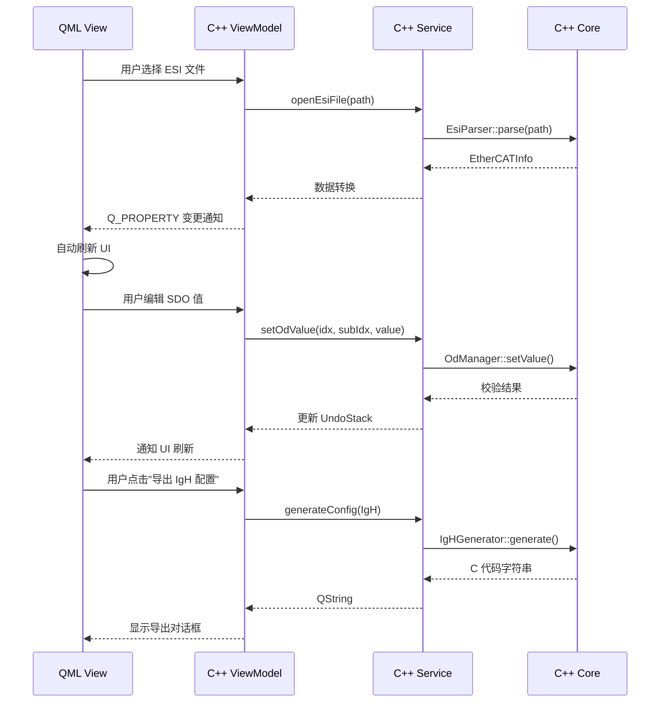
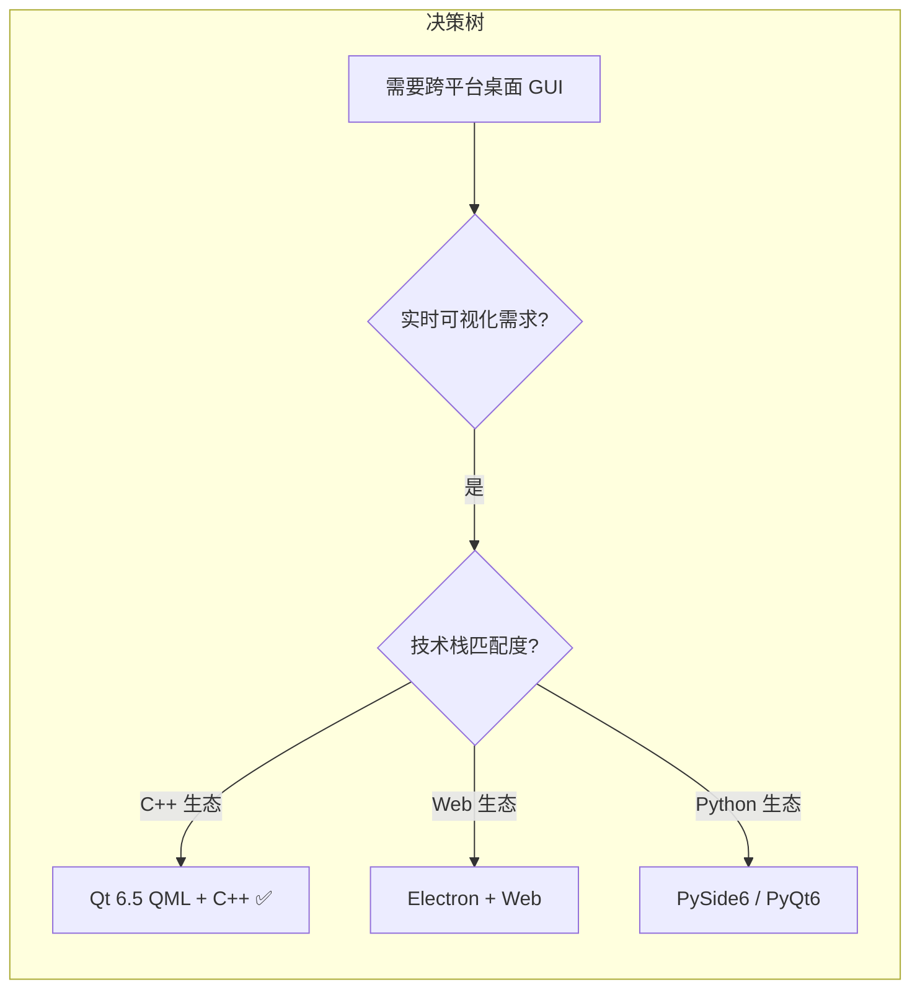

# EtherCAT Lab — 项目评估与技术架构设计文档

> **项目代号**：EtherCAT Lab  
> **定位**：面向 EtherCAT 初学者的开源可视化学习与配置工具  
> **GUI 架构**：Qt 6.5.3 QML + C++ 混合编程  
> **评估 & 架构版次**：v2.0  
> **日期**：2026-06-05  

---

## 目录

- [一、项目整体评价](#一项目整体评价)
- [二、系统架构总览（框架图）](#二系统架构总览框架图)
- [三、各模块实现方案与技术选型](#三各模块实现方案与技术选型)
- [四、技术选型深度对比（为什么选它 / 为什么不选别的）](#四技术选型深度对比为什么选它--为什么不选别的)
- [五、QML + C++ 混合编程架构详解](#五qml--c-混合编程架构详解)
- [六、项目文件结构（QML 版）](#六项目文件结构qml-版)
- [七、开发路线图](#七开发路线图)
- [八、关键技术风险与对策](#八关键技术风险与对策)

---

## 一、项目整体评价

### 1.1 得分总览

| 评价维度 | 评分 | 说明 |
|---------|------|------|
| 问题定义 | ★★★★★ | 痛点真实、目标用户清晰、填补国内空白 |
| 功能设计 | ★★★★☆ | 七大模块覆盖完整，教程系统是亮点 |
| 架构设计 | ★★★★☆ | 分层清晰，数据流完整，设计模式应用合理 |
| 技术选型（Widgets版） | ★★★★☆ | 符合工控场景，但 UI 灵活性和现代感有限 |
| 数据模型 | ★★★★★ | EtherCATInfo 结构完备，OD 建模准确 |
| 开发计划 | ★★★★☆ | 分阶段交付，验收标准明确，工时估算合理 |
| 工程化程度 | ★★★★☆ | CI/CD、测试、打包都有涉及 |
| 开源策略 | ★★★★★ | MIT 许可、中英双语文档、社区建设思路清晰 |

**总评**：这是一份**优秀的工业软件设计文档**。对 EtherCAT 协议栈的理解深入，模块划分合理，数据结构设计专业。原始设计中 GUI 层选用纯 Qt Widgets，在工控场景下实用性强，但在 UI 表现力、动画效果、声明式布局等方面存在天然天花板。

### 1.2 原有设计（Qt Widgets）的优势与局限

**优势**：
- Widgets 的原生控件在 Windows 工控机上渲染稳定，资源占用低
- QTreeView / QTableView 的 Model/View 架构成熟，适合数据密集展示
- QGraphicsView 框架适合自绘 PDO 映射图和概念图谱

**局限**：
- Widgets 的样式定制依赖 QSS，复杂视觉效果实现困难
- 缺乏声明式 UI 描述，布局嵌套深时代码可读性急降
- 不支持硬件加速渲染，动画和高帧率交互受限
- 概念图谱的力导向动画、节点拖拽的丝滑感在 Widgets 下需要大量手写代码

### 1.3 升级到 QML + C++ 混合架构的收益

| 收益点 | 说明 |
|-------|------|
| 声明式 UI | PDO 映射图、概念图谱的节点和连线用 QML `Item` + `Canvas` 描述，代码量减少 40%+ |
| 动画系统 | QML 内置 `NumberAnimation`、`SpringAnimation`，力导向布局和节点高亮一站式解决 |
| GPU 渲染 | Qt Quick 默认 OpenGL/Vulkan 后端，60fps 拖拽和缩放无压力 |
| 开发效率 | QML 热重载（配合 Qt Creator），UI 调整即时可见 |
| 现代 UI | Material / Fluent 风格可实现，暗色模式天然支持 |
| C++ 核心不变 | 所有解析、数据、生成逻辑保持纯 C++/Qt Core，QML 只管展示 |

---

## 二、系统架构总览（框架图）

### 2.1 四层架构

```mermaid
graph TB
    subgraph UI["QML UI Layer (Qt Quick)"]
        direction LR
        MW["MainWindow.qml<br/>主窗口壳"]
        ESIB["EsiBrowser.qml<br/>ESI 浏览器"]
        ODB["OdBrowser.qml<br/>对象字典"]
        PDOV["PdoVisual.qml<br/>PDO 映射图"]
        CG["ConceptGraph.qml<br/>概念图谱"]
        TUT["TutorialView.qml<br/>交互教程"]
        SDO["SdoConfig.qml<br/>SDO 配置器"]
    end

    subgraph VIEWMODEL["C++ ViewModel / Bridge Layer"]
        direction LR
        ESIVM["EsiBrowserVM"]
        ODVM["OdBrowserVM"]
        PDOVM["PdoVisualVM"]
        CGVM["ConceptGraphVM"]
        TUTVM["TutorialEngine"]
        SDOVM["SdoConfigVM"]
    end

    subgraph SERVICE["C++ Service Layer"]
        direction LR
        ES["EsiService"]
        OS["OdService"]
        PS["PdoService"]
        CS["ConfigService"]
        TS["TutorialService"]
    end

    subgraph CORE["C++ Core / Data Layer (Qt Core only)"]
        direction LR
        EP["EsiParser<br/>XML 解析"]
        OM["OdManager<br/>OD 管理"]
        PM["PdoMapper<br/>PDO 映射"]
        CGEN["ConfigGenerator<br/>代码生成基类"]
        IGH["IgHGenerator<br/>IgH C 代码"]
        SME["SoemGenerator<br/>SOEM 配置"]
    end

    UI -->|"Q_PROPERTY / SIGNAL"| VIEWMODEL
    VIEWMODEL -->|"业务调用"| SERVICE
    SERVICE -->|"数据操作"| CORE
```



### 2.2 数据流图



### 2.3 QML + C++ 混合调用关系



---

## 三、各模块实现方案与技术选型

### 3.1 模块一：ESI 文件解析器（Core 层）

| 项目 | 选型 | 详细理由 |
|------|------|---------|
| XML 解析 | `QXmlStreamReader` | Qt 内置，流式解析，大文件内存友好；不引入 libxml2 避免编译复杂度 |
| 数据结构 | 纯 C++ `struct` | 无 Qt 元对象依赖，可独立编译和测试，方便后续做 CLI 版本 |
| 错误处理 | `QString lastError()` + 行号定位 | 比异常更可控，给用户精确到 XML 行号的中文错误提示 |
| 校验器 | 独立 `EsiValidator` 类 | 解析和校验分离，单测各自覆盖，校验规则可配置 |

**为什么不选**：
- **libxml2**：功能强大但引入 C 依赖，Windows 编译链复杂，API 风格与 Qt 不统一
- **TinyXML2**：轻量但需要额外管理生命周期，Qt 项目内不如 `QXmlStreamReader` 自然
- **用异常抛错误**：Qt 生态惯例是用返回值 + `lastError()`，异常在跨 DLL 边界时行为不确定

**实现要点**：
- 解析状态机：`START → READ_ROOT → READ_VENDOR → READ_DESCRIPTIONS → READ_GROUPS → READ_DEVICES → VALIDATE → DONE`
- SM/PDO 必须按索引顺序解析，不依赖 XML 元素出现顺序
- ProductCode / RevisionNo 的 `#x...` 格式用 `HexUtils::parseHexString()` 统一处理

---

### 3.2 模块二：对象字典浏览器（ViewModel + QML）

| 项目 | 选型 | 详细理由 |
|------|------|---------|
| C++ Model | 自定义 `OdListModel : QAbstractListModel` | QML `ListView` 直接绑定 C++ Model，零拷贝数据访问 |
| 过滤/搜索 | `QSortFilterProxyModel` 挂在 C++ 侧 | QML 侧 `TextField` 输入 → C++ `setFilterFixedString()`，比 QML 纯前端过滤性能好 |
| 树形展示 | QML `TreeView` (Qt 6.5 引入) | 原生树控件，比递归 `Delegate` 嵌套实现简单且性能好 |
| 条目详情 | QML `Control` + `Label` 组合 | 声明式布局，属性面板自适应内容高度 |

**为什么不选**：
- **旧版 QML 递归 Delegate 实现树**：代码复杂度高，展开/折叠状态管理困难，Qt 6.5 的 `TreeView` 已足够成熟
- **纯 C++ QTreeView**：与 QML 架构割裂，需要 `QWidget::createWindowContainer()` 嵌入，丧失 QML 动画能力
- **前端全量过滤**：当 OD 条目超过 500 条时，JS 侧过滤会有可感知的 UI 卡顿

**实现要点**：
- OD 标准基线数据（0x1000–0x1C00）硬编码在 `EtherCATDefs.h`，约 200+ 条目
- `OdManager::loadFromEsi()` 合并 ESI 自定义条目覆盖基线
- PDO 可映射条目用 `role: "pdoMappable"` 返回 `true`，QML Delegate 根据该 role 显示绿色标记

---

### 3.3 模块三：PDO 映射可视化器（QML Canvas + C++ ViewModel）

| 项目 | 选型 | 详细理由 |
|------|------|---------|
| 图形渲染 | QML `Canvas` (HTML5 Canvas API) | 2D 自绘能力足够，比 `QGraphicsScene` 更适合 QML 架构 |
| 数据驱动 | C++ `PdoVisualVM` 暴露 `QAbstractListModel` | SM 列表、PDO 列表、Entry 列表分别 Model，QML `Repeater` 绑定 |
| 高亮联动 | `Q_PROPERTY selectedSmIndex NOTIFY` | QML 侧 `onSelectedSmIndexChanged` 快速响应 |
| 内存布局图 | `Canvas` 绘制 bit 偏移条形图 | 比 Widgets 手写 `paintEvent` 简洁 |

**为什么不选**：
- **QGraphicsScene + QGraphicsView**（原方案）：功能最强大但不适合 QML 架构，嵌入需要 `QQuickPaintedItem` 桥接，增加复杂度且 GPU 加速失效
- **Qt Charts**：面向数据图表而非自定义拓扑图，PDO 映射是树状/块状结构，Chart 的坐标系限制大
- **QML ShapePath (Qt Quick Shapes)**：适合精确矢量，但动态节点数量多时不如 `Canvas` 灵活

**实现要点**：
- Canvas 绘制流程：
  1. SM 块：`roundedRect` + `fillStyle`（Inputs=绿色，Outputs=橙色）
  2. PDO 块：`rect` 嵌套在对应 SM 下方
  3. Entry 行：`fillText` 显示名称 + 索引 + bit 长度
  4. 连线：`moveTo` / `lineTo` 连接 SM → PDO → Entry
- 布局计算在 C++ 侧完成，QML 只负责 `requestPaint()`
- 超出 SM 容量的 PDO 标红：C++ `exceedsCapacity` role → QML Delegate 设置 `border.color: "red"`

---

### 3.4 模块四：概念知识图谱（QML Item + Behavior Animation + C++ 数据）

| 项目 | 选型 | 详细理由 |
|------|------|---------|
| 节点渲染 | QML `Rectangle` + `Text` | 声明式，样式修改即时生效，hover/press 状态内建 |
| 连线渲染 | QML `Canvas` | 贝塞尔曲线 `bezierCurveTo` 绘制关系边 |
| 力导向布局 | C++ `ForceDirectedLayout` 类 | 计算密集，放 C++ 侧运行，每帧推送节点坐标 |
| 动画 | QML `Behavior on x/y {}` + `SpringAnimation` | 节点位置变化自动插值，丝滑过渡 |
| 手势交互 | QML `PinchHandler` + `DragHandler` | 多指缩放 + 拖拽，Qt Quick 原生支持 |

**为什么不选**：
- **QGraphicsScene（原方案）**：同上，QML 架构下不宜混用
- **D3.js / ECharts via WebEngine**：WebEngine 在 Qt 6.5 中体积大（~70MB+），启动慢，且嵌入方案增加交互事件桥接复杂度
- **纯 QML JS 力导向算法**：JS 引擎在 30+ 节点时每帧计算力导向布局会有 15-30ms 开销，C++ 侧可以控制在 2ms 内

**实现要点**：
- 概念数据文件 `concept_graph.json` 定义节点和边
- `ConceptGraphVM` 暴露 `Q_PROPERTY(QVariantList nodes READ nodes NOTIFY nodesChanged)` 和 `Q_PROPERTY(QVariantList edges READ edges NOTIFY edgesChanged)`
- 力导向迭代放在 `QTimer` 驱动的独立 worker 线程，避免阻塞 UI
- 每个节点 `Item` 绑定 `Behavior on x { SpringAnimation { spring: 2; damping: 0.4 } }` 实现物理感拖拽

---

### 3.5 模块五：交互式教程系统（QML + C++ TutorialEngine）

| 项目 | 选型 | 详细理由 |
|------|------|---------|
| 教程数据 | JSON 文件（`resources/tutorials/*.json`） | 非程序员可编辑，可热加载 |
| 步骤驱动 | C++ `TutorialEngine : QObject` | 管理状态机，验证用户操作，发射 `stepCompleted()` 信号 |
| UI 展示 | QML `StackLayout` + 自定义 `TutorialStepDelegate` | 每步独立 QML Item，`currentIndex` 绑定引擎状态 |
| 步骤高亮 | QML `Item` 叠加半透明遮罩 + 目标控件置顶 | 指导用户点击特定 UI 区域 |
| 进度持久化 | `QSettings` | 记录已完成教程和步骤，跨会话保持 |

**为什么不选**：
- **Qt Help Framework**：面向 API 文档而非交互式教程，不支持步骤验证和高亮
- **WebEngine 嵌入 Web 教程**：与桌面 UI 交互困难，事件桥接复杂
- **全 JSON 配置无验证逻辑**：教程"走过场"体验差，C++ 引擎可以监听实际 UI 事件（如 OD 树节点被点击、SDO 值被修改）来验证用户操作

**实现要点**：
- JSON 格式：每个步骤定义 `interactiveTarget`（UI 组件 objectName）、`expectedAction`、`verificationRule`
- `TutorialEngine` 通过 `QMetaObject::invokeMethod` 或信号监听目标 ViewModel 的状态变化来验证步骤
- 教程面板采用 `Drawer` 弹出式，不遮挡主工作区

---

### 3.6 模块六 & 七：SDO 配置器 + 配置文件生成器

| 项目 | 选型 | 详细理由 |
|------|------|---------|
| 表格编辑 | QML `TableView` (Qt 6.5) | 原生表格控件，支持冻结列、自定义 Delegate |
| 撤销/重做 | C++ `QUndoStack` | Qt 原生 Undo 框架，比手写快照模式更可维护 |
| 数据校验 | C++ `QValidator` 子类 + ViewModel 层 | 十进制/十六进制切换由 C++ 完成，QML 只展示 |
| 代码生成 | C++ `Strategy` 模式 + Mustache 模板 | 模板化生成 C/JSON，模板文件可单独测试和修改 |
| 预设目标 | IgH、SOEM、通用 JSON | 策略模式添加新目标无需改 UI 代码 |

**为什么不选**：
- **QML 侧手写代码生成逻辑**：生成 C 代码需要处理缩进、注释、对齐，QML JS 字符串拼接容易出错且无法复用
- **直接使用 `QTextStream` 拼接**：没有模板层的抽象，修改输出格式需要改 C++ 源码，不如 Mustache 模板可让用户自行定制
- **用 QML `TextField` 直接编辑 OD 值**：校验逻辑必须回到 C++，往返通信延迟在连续编辑时可感知

**实现要点**：
- IgH 生成器输出示例格式已在上游文档中定义，C 结构体 `ec_pdo_entry_info_t` / `ec_pdo_info_t` / `ec_sync_info_t` 三连带注释
- 导出时提供预览窗口（QML `ScrollView` + `TextArea`），确认后再写文件
- 模板文件存放在 `resources/templates/`，使用 `{{variable}}` 语法

---

## 四、技术选型深度对比（为什么选它 / 为什么不选别的）

### 4.1 GUI 框架：Qt 6.5.3 QML + C++ vs. 其他方案



| 对比维度 | Qt 6.5 QML+C++ | Qt Widgets | Electron | Flutter Desktop | WinForms/WPF |
|---------|---------------|------------|----------|----------------|--------------|
| 渲染性能 | GPU 加速，60fps+ | CPU 自绘，大场景吃力 | Chromium 开销大 | Skia 引擎，较好 | 仅 Windows |
| 动画能力 | 内置 Behavior/SpringAnim | 需手写 QTimeLine | CSS Animation | Animation API | Storyboard |
| 跨平台 | Win/Linux/macOS | Win/Linux/macOS | Win/Linux/macOS | Win/Linux/macOS | 仅 Windows |
| 打包体积 | ~40MB (Qt Quick) | ~30MB (Qt Widgets) | ~120MB+ | ~50MB | N/A |
| C++ 集成 | 原生无缝 | 原生无缝 | 需 Node 原生模块 | 需 FFI | 原生 |
| 工控场景适配 | 触屏友好 | 传统桌面友好 | 资源消耗大 | 生态不成熟 | 仅 Windows |
| 学习曲线 | 中等 | 低（Qt 经典） | 低（Web 开发者） | 中 | 低（Windows 开发者） |
| 热重载 | Qt Creator 支持 | Qt Designer | Webpack HMR | Hot Reload | XAML Hot Reload |

**结论**：Qt 6.5 QML + C++ 是工控可视化工具的最优解。它同时满足 GPU 渲染性能、C++ 核心逻辑复用、声明式 UI 开发效率。

---

### 4.2 编程语言：C++17

| 对手 | 劣势 | QML/JS 侧的角色 |
|------|------|----------------|
| **Python (PySide6)** | GIL 限制多线程解析大文件；打包需嵌入 CPython 运行时（+30MB）；工控用户不熟悉 | — |
| **Rust + Slint** | Slint UI 框架过于年轻（2024 年 1.0），控件库不成熟，社区小 | — |
| **C# + Avalonia** | 跨平台但工控 Linux 部署复杂，.NET 运行时依赖大 | — |
| **QML 侧 JS** | 仅用于简单属性绑定和信号处理 | 逻辑入口始终在 C++，JS 不承担解析/计算任务 |

---

### 4.3 图形渲染：QML Canvas vs. QGraphicsView vs. QQuickPaintedItem

| 方案 | GPU 加速 | 自绘灵活度 | QML 集成 | 推荐场景 |
|------|---------|----------|---------|---------|
| **QML Canvas** | ✅ 是（OpenGL 纹理） | 高（HTML5 2D API） | 原生 QML Item | 2D 拓扑图、流程图 |
| QGraphicsView | ❌ 否（CPU raster） | 极高（完整场景图） | 需 `QQuickPaintedItem` 桥接 | 复杂矢量编辑 |
| QQuickPaintedItem | ⚠️ 半（CPU 绘制→纹理上载） | 高（QPainter API） | 原生 QML Item | 兼容旧 QPainter 代码 |
| QML ShapePath | ✅ 是 | 中（仅矢量形状） | 原生 QML Item | 静态图标、简单形状 |

**本项目选择**：
- PDO 映射图：`Canvas` — 块状 + 连线 + 文字标签的组合天然适合 Canvas
- 概念图谱：`Item` + `Behavior` + `Canvas`（连线） — 节点用原生 QML Item 获得完整交互能力和动画，连线用 Canvas 绘制曲线

---

### 4.4 XML 解析：QXmlStreamReader vs. DOM vs. 第三方库

| 方案 | 内存占用 | 大文件支持 | 依赖 | 流式处理 |
|------|---------|----------|------|---------|
| **QXmlStreamReader** | 低（逐元素读取） | ✅ 优秀 | 无（Qt 内置） | ✅ 是 |
| QDomDocument (DOM) | 高（全量加载） | ❌ 大 ESI 文件可能 OOM | 无（Qt 内置） | ❌ 否 |
| libxml2 | 低 | ✅ 优秀 | 第三方 C 库 | ✅ 是 |
| pugixml | 低 | ✅ 优秀 | 第三方 C++ 库 | ❌ 否（DOM） |

ESi 文件通常不大（几十 KB 到几 MB），但遵循"最小依赖原则"，`QXmlStreamReader` 是最干净的选择。

---

### 4.5 包管理 & 构建

| 方案 | 推荐度 | 理由 |
|------|-------|------|
| **CMake + Qt 官方安装包** | ★★★★★ | Qt 6.5 官方只有在线安装器，CMake 集成最标准 |
| CMake + vcpkg | ★★★★☆ | Windows 上一条龙，但 Qt 6.5 的 vcpkg port 偶尔滞后 |
| CMake + Conan | ★★★☆☆ | 工业级但配置复杂，对小项目过重 |
| qmake | ★★☆☆☆ | Qt 6 已弃用 qmake，不推荐新项目使用 |

---

### 4.6 测试框架

| 方案 | 推荐度 | 理由 |
|------|-------|------|
| **Qt Test (QTestLib)** | ★★★★★ | Qt 生态原生，支持 GUI 测试、benchmark，与 CI 集成成熟 |
| Google Test | ★★★★☆ | C++ 测试标杆，但不支持 Qt 信号/事件循环测试 |
| Catch2 | ★★★☆☆ | 轻量但 Qt 集成不如 Qt Test 自然 |

结论：核心层（`EsiParser`、`OdManager`、`PdoMapper`、`ConfigGenerator`）用 Qt Test 做单元测试，ViewModel 层做集成测试。

---

## 五、QML + C++ 混合编程架构详解

### 5.1 核心设计原则

1. **C++ 拥有数据和逻辑，QML 只负责展示和交互反馈**
2. **ViewModel 层是唯一的 C++↔QML 桥接点**
3. **Core 层（解析/数据/生成）零 Qt GUI 依赖，只依赖 Qt Core**
4. **每个 ViewModel 暴露 `Q_PROPERTY`、`Q_INVOKABLE` 方法、以及必要的 `QAbstractListModel`**

### 5.2 关键类的 QML 暴露方式

```cpp
// ===== ViewModel 示例：PdoVisualVM =====
class PdoVisualVM : public QObject {
    Q_OBJECT
    // SM 列表（给 QML Repeater 绑定）
    Q_PROPERTY(QAbstractListModel* smListModel READ smListModel CONSTANT)
    // PDO 列表（给 QML Repeater 绑定）
    Q_PROPERTY(QAbstractListModel* pdoListModel READ pdoListModel CONSTANT)
    // 当前选中的 SM 索引
    Q_PROPERTY(int selectedSmIndex READ selectedSmIndex WRITE setSelectedSmIndex NOTIFY selectedSmIndexChanged)
    // 当前选中的 PDO 索引
    Q_PROPERTY(int selectedPdoIndex READ selectedPdoIndex WRITE setSelectedPdoIndex NOTIFY selectedPdoIndexChanged)
    // 超出容量的 PDO 列表（用于标红）
    Q_PROPERTY(QVariantList overflowPdoIndices READ overflowPdoIndices NOTIFY overflowPdoIndicesChanged)

public:
    explicit PdoVisualVM(QObject* parent = nullptr);

    Q_INVOKABLE void loadFromDevice(const QString& deviceId);
    Q_INVOKABLE QVariantMap getSmLayout(int smIndex);  // SM 位布局信息

signals:
    void selectedSmIndexChanged();
    void selectedPdoIndexChanged();
    void overflowPdoIndicesChanged();

private:
    std::unique_ptr<PdoService> m_service;
    std::unique_ptr<SmListModel> m_smModel;
    std::unique_ptr<PdoListModel> m_pdoModel;
};
```

### 5.3 注册到 QML

```cpp
// main.cpp
int main(int argc, char* argv[]) {
    QGuiApplication app(argc, argv);

    // 注册 C++ 类型到 QML
    qmlRegisterType<EsiBrowserVM>("EtherCATLab", 1, 0, "EsiBrowserVM");
    qmlRegisterType<OdBrowserVM>("EtherCATLab", 1, 0, "OdBrowserVM");
    qmlRegisterType<PdoVisualVM>("EtherCATLab", 1, 0, "PdoVisualVM");
    qmlRegisterType<ConceptGraphVM>("EtherCATLab", 1, 0, "ConceptGraphVM");
    qmlRegisterType<TutorialEngine>("EtherCATLab", 1, 0, "TutorialEngine");
    qmlRegisterType<SdoConfigVM>("EtherCATLab", 1, 0, "SdoConfigVM");

    // 注册枚举类型
    qmlRegisterUncreatableMetaObject(
        EtherCATEnums::staticMetaObject,
        "EtherCATLab", 1, 0,
        "EtherCATEnums", "Cannot create enum namespace"
    );

    QQmlApplicationEngine engine;
    engine.load(QUrl(QStringLiteral("qrc:/qml/MainWindow.qml")));

    return app.exec();
}
```

### 5.4 QML 侧典型绑定

```qml
// PdoVisual.qml 片段
Item {
    id: root

    property PdoVisualVM viewModel: PdoVisualVM {}

    // SM 块列表
    Row {
        spacing: 12
        Repeater {
            model: viewModel.smListModel
            Rectangle {
                width: 160; height: 80
                radius: 8
                color: model.type === "Inputs" ? "#4CAF50" : "#FF9800"
                border.width: viewModel.selectedSmIndex === index ? 3 : 0
                border.color: "#FFFFFF"

                Text {
                    anchors.centerIn: parent
                    text: model.name + "\n" + model.defaultSize + "B"
                    color: "white"
                    horizontalAlignment: Text.AlignHCenter
                }

                MouseArea {
                    anchors.fill: parent
                    onClicked: viewModel.selectedSmIndex = index
                }
            }
        }
    }

    // PDO 映射细节 - Canvas 绘制
    Canvas {
        id: pdoCanvas
        anchors.fill: parent
        onPaint: {
            var ctx = getContext("2d");
            // 绘制连线、PDO 块、Entry 行...
        }
        Connections {
            target: viewModel
            function onSelectedSmIndexChanged() { pdoCanvas.requestPaint(); }
            function onOverflowPdoIndicesChanged() { pdoCanvas.requestPaint(); }
        }
    }
}
```

---

## 六、项目文件结构（QML 版）

```
EtherCATLab/
├── CMakeLists.txt
├── README.md
├── README_zh.md
├── LICENSE
│
├── qml/                               # QML UI 层
│   ├── MainWindow.qml                 # 主窗口（Drawer 侧边栏 + StackLayout 中央区 + 属性面板）
│   ├── components/                    # 通用 QML 组件
│   │   ├── SearchBar.qml              # 带图标的搜索输入框
│   │   ├── StatusBar.qml              # 底部状态栏
│   │   ├── MarkdownView.qml           # 简易 Markdown 渲染（教程/概念详情用）
│   │   └── DarkTheme.qml              # 暗色主题配置文件
│   ├── esibrowser/
│   │   ├── EsiBrowserView.qml         # ESI 树形浏览
│   │   └── EsiDetailPanel.qml         # 选中节点详情
│   ├── odbrowser/
│   │   ├── OdBrowserView.qml          # OD TreeView + 搜索栏
│   │   └── OdDetailPanel.qml          # OD 条目属性面板
│   ├── pdovisual/
│   │   └── PdoVisualView.qml          # SM→PDO→Entry 可视化
│   ├── concepts/
│   │   └── ConceptGraphView.qml       # 力导向图谱
│   ├── tutorials/
│   │   ├── TutorialShell.qml          # 教程抽屉外壳
│   │   └── TutorialStepView.qml       # 单步视图
│   └── configurator/
│       ├── SdoConfigView.qml          # SDO 编辑表格
│       └── ConfigExportDialog.qml     # 配置导出对话框
│
├── src/                               # C++ 源码
│   ├── CMakeLists.txt
│   ├── main.cpp
│   │
│   ├── core/                          # 核心数据层（零 QML 依赖）
│   │   ├── EsiParser.h/cpp
│   │   ├── EsiValidator.h/cpp
│   │   ├── EtherCATInfo.h             # 纯数据结构
│   │   ├── OdManager.h/cpp
│   │   ├── PdoMapper.h/cpp
│   │   └── EtherCATDefs.h             # 常量 + 标准 OD 基线
│   │
│   ├── service/                       # Service 层
│   │   ├── EsiService.h/cpp
│   │   ├── OdService.h/cpp
│   │   ├── PdoService.h/cpp
│   │   ├── ConfigService.h/cpp
│   │   └── TutorialService.h/cpp
│   │
│   ├── viewmodel/                     # ViewModel 层（QML 桥接）
│   │   ├── EsiBrowserVM.h/cpp
│   │   ├── OdBrowserVM.h/cpp
│   │   ├── PdoVisualVM.h/cpp
│   │   ├── ConceptGraphVM.h/cpp
│   │   ├── TutorialEngine.h/cpp
│   │   └── SdoConfigVM.h/cpp
│   │
│   ├── models/                        # Qt Model 实现
│   │   ├── OdListModel.h/cpp          # QAbstractListModel
│   │   ├── SmListModel.h/cpp
│   │   ├── PdoListModel.h/cpp
│   │   └── ConceptGraphModel.h/cpp
│   │
│   ├── generators/                    # 配置生成器
│   │   ├── ConfigGenerator.h/cpp      # 基类
│   │   ├── IgHGenerator.h/cpp
│   │   ├── SoemGenerator.h/cpp
│   │   └── JsonGenerator.h/cpp
│   │
│   └── utils/
│       ├── HexUtils.h/cpp
│       ├── ForceDirectedLayout.h/cpp  # 力导向布局算法
│       └── AppSettings.h/cpp
│
├── resources/
│   ├── qml.qrc                        # QML 资源文件
│   ├── examples/                      # 示例 ESI 文件
│   ├── tutorials/                     # 教程 JSON
│   ├── concepts/
│   │   └── concept_graph.json         # 概念图谱数据
│   ├── templates/                     # 代码生成模板
│   │   ├── igh_template.mustache
│   │   └── soem_template.mustache
│   └── i18n/                          # 国际化
│       ├── ethercatlab_zh.ts
│       └── ethercatlab_en.ts
│
├── tests/
│   ├── CMakeLists.txt
│   ├── tst_EsiParser.cpp
│   ├── tst_OdManager.cpp
│   ├── tst_PdoMapper.cpp
│   ├── tst_ConfigGenerator.cpp
│   ├── tst_ForceDirectedLayout.cpp
│   └── data/
│       ├── valid_simple.xml
│       ├── valid_servo.xml
│       └── invalid_broken.xml
│
└── .github/workflows/
    ├── build-windows.yml
    └── build-linux.yml
```

---

## 七、开发路线图

| 阶段 | 时间 | 目标 | Qt Widgets→QML 迁移要点 |
|------|------|------|------------------------|
| **Phase 1** | 第 1–3 周 | CMake 工程 + EsiParser + 主窗口壳 + ESI 树形浏览 | 用 QML `TreeView` 替代 `QTreeView`，注册 `EsiBrowserVM` |
| **Phase 2** | 第 4–6 周 | OD 浏览器 + 搜索 + 详情 | `OdListModel` (QAbstractListModel) + `QSortFilterProxyModel` → QML `ListView` |
| **Phase 3** | 第 7–9 周 | PDO 可视化 + 概念图谱 | QML `Canvas` 替代 `QGraphicsScene`；`ForceDirectedLayout` + `Behavior` 动画 |
| **Phase 4** | 第 10–12 周 | 教程 + SDO 配置器 + 配置生成 + 打包 | QML `TableView` 替代 `QTableView`；Mustache 模板引擎 |
| **Polish** | 第 13–14 周 | 国际化、暗色模式、安装包、文档 | QML `Theme` 全局切换；NSIS/AppImage 打包 |

---

## 八、关键技术风险与对策

| 风险 | 严重度 | 对策 |
|------|-------|------|
| Qt 6.5 `TreeView` 在大量节点时性能不足 | 中 | 超过 500 节点启用虚拟化滚动（`reuseItems: true`），或降级为 `ListView` 展开模式 |
| ESI 厂商格式差异导致解析失败 | 高 | Parser 采用"尽力而为"策略，错误日志精确到 XML 行号，维护厂商兼容列表 |
| 力导向布局在 30+ 节点时卡顿 | 低 | 布局计算放 C++ worker 线程，QML 只消费坐标更新 |
| QML `Canvas` 在高 DPI 下模糊 | 中 | 使用 `Canvas.width * Screen.devicePixelRatio` 双倍分辨率绘制 |
| 跨平台字体渲染差异 | 低 | 使用 Qt 内置字体或 `resources/fonts/` 嵌入开源中文字体（如思源黑体） |

---

> **文档版本**：v2.0  
> **与原 Widgets 方案的差异**：GUI 层从 `QMainWindow` + `QGraphicsView` 全面迁移到 `QML ApplicationWindow` + `Canvas` + `Behavior` 动画，C++ 核心逻辑、Service 层、数据模型完全复用，仅 View 层和 ViewModel 层重新设计。
