# EtherCAT Lab

面向 **基于 SOEM 的 EtherCAT 主站** 联调场景开发的 Qt 辅助平台：一侧做多厂商 ESI 协议解析，一侧对运行时 **process image（IOMap）** 做远程接收与 entry 级解码监视，衔接「PDO 映射配置 → 真机 cyclic 运行 → 过程数据排查」的完整链路。

---

## 技术栈

| 类别 | 说明 |
|------|------|
| **语言** | C++17 |
| **UI 框架** | Qt 6.x（MinGW 64-bit 套件） |
| **界面** | Qt Quick / **QML** + Qt Quick Controls 2（Fusion 风格） |
| **网络** | `Qt Network`（`QTcpServer` / `QTcpSocket`） |
| **构建** | **qmake**（`EtherCAT-Lab.pro`，非 CMake） |
| **XML** | `QXmlStreamReader` 流式解析 ESI |
| **平台** | 主要面向 Windows（PC 端监视）；设备侧桥接层为 POSIX C，与 OS 无关 |

### QML 与 C++ 如何协作

```
main.cpp
  └─ QQmlApplicationEngine
        ├─ contextProperty: ESITreeModel   ←→  ESI Browser（树 / 详情）
        ├─ contextProperty: SimEngine      ←→  Simulate（拓扑 / PDO / 帧）
        ├─ contextProperty: NetworkManager ←→  IOMap Monitor（TCP / 解码 / 实时值）
        └─ load("qrc:/main.qml")
```

---

## 编译与运行

### 环境要求

- **Qt 6.x**，组件：Qt Quick、Qt Quick Controls 2、Qt XML、**Qt Network**
- 编译器：**MinGW 64-bit**（与 Qt 套件匹配）
- 推荐 IDE：**Qt Creator**

### 命令行构建（Windows）

在 Qt MinGW 命令行环境中，于项目根目录执行：

```bash
qmake EtherCAT-Lab.pro
mingw32-make
```

- **Release** 产物：`release/EtherCAT-Lab.exe`
- **Debug** 产物：`debug/EtherCAT-Lab.exe`

### 快速试用

| 页面 | 操作 |
|------|------|
| **ESI Browser** | Open ESI / Ctrl+O / 拖放，加载 `test_esi/` 下 XML |
| **Simulate** | 双击 Device 加入拓扑 → 配 PDO → Step/Run 看 LRW 帧 |
| **IOMap Monitor** | 配置物理链路从站与 PDO 映射 → 监听 TCP → 连接设备桥接层 → 开始接收 → 右侧看实时解码值 |

---

## 项目简介

实习与联调中常见的痛点：**过程数据只能 `printk` / `dmesg` 看裸 hex**，改一个观察对象就要改 offset、重编、重刷；映射与 ESI 对不上时只能人肉逐字节换算。

**EtherCAT Lab** 把问题拆成三块互补能力：

| 模块 | 作用 |
|------|------|
| **ESI Browser** | 流式解析多厂商 ESI XML → 内存模型 → 树形浏览 + 详情面板（见下文专节） |
| **Simulate** | 菊花链拓扑 + PDO 映射预配置，计算过程映像 offset，生成 LRW 帧做映射预验证 |
| **IOMap Monitor** | 接收设备侧推送的 **真实 IOMap 快照**，按用户配置的 entry 偏移解码为对象字（如 0x6040、0x607A），实时显示 hex + 十进制 |

**定位**：SOEM 主站联调辅助工具，**非** TwinCAT / IgH 替代实现。  
IOMap 是 SOEM 标准机制（`ec_config_map_group` 后的连续 `uint8[]`），因此监视方案对 **任何正确导出 IOMap 的 SOEM 主站** 通用，不绑定某一厂商 HAL。

---

## ESI Browser — 完整说明

ESI（EtherCAT Slave Information）是各厂商发布的从站描述 XML，等价于一份「设备说明书」：告诉你这台从站有哪些对象字典条目、默认 PDO 映射长什么样、邮箱支持哪些协议、DC 怎么配。主站集成前若不对照 ESI，PDO 映射、SM 分配、互斥关系很容易和真机不一致。

**ESI Browser** 是本项目的 Phase 1 核心：把动辄数百 KB 的 XML 解析成可浏览的树，并在右侧详情面板展示结构化字段，供集成前核对设备能力；解析结果同时供 **Simulate**（`getDeviceDetail`）和人工配置 **IOMap Monitor** 时参考。

---

### 1. ESI 在 EtherCAT 集成中的位置

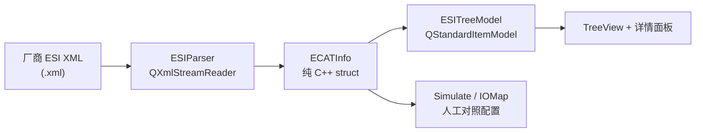

| 阶段 | 你要回答的问题 | 本模块提供什么 |
|------|----------------|----------------|
| 选型 | 这台驱动支持 CiA 402 吗？有哪些 PDO 预设？ | Device / Profile / RxPdo / TxPdo 树节点 |
| 映射 | 0x6040 在哪个 PDO？和哪个 PDO 互斥？ | PdoEntry + `<Exclude>` 列表 |
| 模块化 | 多轴设备 Slot 怎么递增索引？ | Slots / ModuleIdent / Module 节点 |
| 字典 | 0x6060 是什么类型？子索引有哪些？ | Dictionary / Object / SubItem |
| 联调 | 和真机配置是否一致？ | 与 Simulate、IOMap layout 人工比对 |

---

### 2. 支持的 XML 根格式

解析器入口 `ESIParser::parseECATInfo()` 自动识别根元素：

| 根元素 | 典型厂商 | 顶层内容 | 说明 |
|--------|----------|----------|------|
| `<EtherCATInfo>` | Copley、Beckhoff、Weidmueller、Kollmorgen | `Vendor` + `Groups` + `Devices` (+ `Modules`) | 标准从站描述，一文件可多 Device |
| `<EtherCATModule>` | Weidmueller UR 系列模块化 IO | `Vendor` + `Groups` + `Modules` | 无 Device 壳，298 个 Module 独立描述 |

两种格式最终都落入同一个 `ECATInfo` 容器，由 `ESITreeModel` 统一建树。

---

### 3. 数据模型（`interfaces/ESI_def.h`）

约 20 个纯 C++ `struct`，无 Qt 依赖，完整映射 `EtherCATInfo` 规范的主要字段：

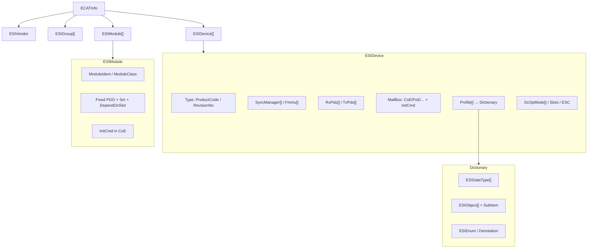

**关键结构说明：**

| 结构 | 对应 XML | 集成时最常用的字段 |
|------|----------|-------------------|
| `ESIDevice` | `<Device>` | `productCode`、`revisionNo`、`physics`、`groupType` |
| `ESISm` | `<Sm>` | `name`（MBoxOut/Outputs/Inputs…）、`startAddress`、`controlBytes`、`defaultSize` |
| `ESIRxpdo` / `ESITxpdo` | `<RxPdo>` / `<TxPdo>` | `fixed`、`index`、`excludes[]`（互斥 PDO）、`entries[]` |
| `ESIPdoEntry` | `<Entry>` | `index`（如 `#x6040`）、`subIndex`、`bitLen`、`dataType`、`name` |
| `ESIMailBox` | `<Mailbox>` | `coe` + `coePdoAssign` / `coePdoConfig`；`initCmds[]`（上电 SDO） |
| `ESIProfile` | `<Profile>` | `profileNo`（如 402）、内嵌 `ESIDictionary` |
| `ESIObject` | `<Object>` | `index`、`type`、`bitSize`、`flags.access`、`objEnum` |
| `ESISlots` | `<Slots>` | `slotIndexIncrement`（支持 `#x800` 十六进制）、`slotList[]` |
| `ESIModule` | `<Module>` | `moduleIdent`、`modulePdoGroup`；预定义 Fixed PDO |

---

### 4. 解析器能力与覆盖范围

`ESIParser` 基于 `QXmlStreamReader` **流式解析**，不构建 DOM，单文件 600KB 级 XML 可在秒级完成。

| 层级 | 解析函数 | 已覆盖字段 |
|------|----------|------------|
| 顶层 | `parseECATInfo` / `parseEtherCATModule` | Vendor, Groups, Devices, Modules, InfoReference（跳过引用） |
| Vendor | `parseVendor` | Id, Name, ImageData16x14, FileVersion |
| Group | `parseGroups` | SortOrder, Type, Name, 图标 |
| Device | `parseDevices` | Physics, Type, Name, GroupType, Fmmu, Sm, RxPdo, TxPdo, Mailbox, Eeprom, Profile, Dc, Slots, ESC, ImageData16x14 |
| Mailbox | `parseMailBox` | DataLinkLayer, EoE/CoE/FoE/AoE/SoE/VoE, CoE 属性, InitCmd |
| Dictionary | `parseDictionary` | DataType（含 ArrayInfo/SubItem）, Object（含 Enum/SubItem/Flags） |
| Profile | `parseProfile` | ProfileNo, AddInfo, Dictionary |
| Module | `parseModule` | Type(@ModuleIdent/@ModuleClass/@ModulePdoGroup), Name, RxPdo, TxPdo, Mailbox, Profile |
| Dc | `parseDcOpModes` | Name, Desc, AssignActivate, CycleTimeSync0(Factor), ShiftTimeSync0 |
| Slots | `parseSlots` | SlotPdoIncrement, SlotIndexIncrement, Slot → Name/Max/MinInstances/ModuleIdent |
| ESC | `parseESC` | Reg0108/0400/0410/0420 + 未知 Reg 存入 `extraRegs` map |
| Enum | `parseEnum` | Enum/Denotation/Indication（Beckhoff 系位域标注） |

**解析器实现的工程细节（影响正确性）：**

- **自闭合元素**（如 `<EoE/>`、`<FoE/>`）必须 `skipCurrentElement()`，否则 reader 卡死、后续同级元素全部丢失
- **`#x` 前缀十六进制**（如 `SlotIndexIncrement="#x800"`）需手动转 hex，Qt `toUInt()` 不会自动识别
- **`DependOnSlot`** 在 XML 里位于 `<Index>` 标签属性上，解析时从 Index 读入再赋给 PDO/Entry
- **CoE 两种形态**：Device 层常见自闭合 `<CoE PdoAssign="1" …/>`；Module 层常见带子元素 `<CoE><InitCmd>…</InitCmd></CoE>`

---

### 5. 已知未解析 / 简化字段

按对集成影响分级（完整列表见 `CLAUDE.md`）：

| 级别 | 字段 | 厂商 | 说明 |
|------|------|------|------|
| 🟡 | `HideType` | Beckhoff | Device 硬件版本遮蔽列表 |
| 🟡 | `Info/Electrical/EBusCurrent` | Beckhoff, Weidmueller | E-bus 电流 |
| 🟡 | `Info/Port` | Beckhoff | 物理端口 MII/EBUS |
| 🟡 | `Info/Mailbox/Timeout` | Weidmueller | 邮箱超时 |
| 🟡 | 多语言 `Name`（`LcId`） | Beckhoff | 仅保留最后一个 |
| 🟢 | `RxPdo/TxPdo/@Mandatory` | Weidmueller | 必选 PDO 标记 |
| 🟢 | `InfoReference` | Weidmueller | 跨文件引用，当前跳过 |

不影响「浏览 PDO 映射 + 对象字典 + 互斥关系」的主流程。

---

### 6. 树模型与 QML 桥接（`ESITreeModel`）

解析完成后，`ESITreeModel` 将 `ECATInfo` 展开为 `QStandardItemModel`，供 `TreeView` 绑定。

**节点类型（`NodeType` 枚举，共 20+ 种）：**

```
Vendor
├── Group
└── Device
    ├── TimeoutInfo
    ├── SyncManager / Fmmu
    ├── RxPdo / TxPdo
    │   └── PdoEntry
    ├── Mailbox / InitCmd / Eeprom
    ├── Dc → DcOpMode
    ├── Slot → ModuleIdent
    ├── Esc
    └── Profile
        └── Dictionary
            ├── DataTypeNode
            └── Object → SubItem

Module（EtherCATModule 格式根下）
├── RxPdo / TxPdo → PdoEntry
├── Mailbox / InitCmd
└── Profile → Dictionary …
```

**自定义 Role（合并基类 `roleNames()`，不覆盖 `display`）：**

| Role | QML 访问名 | 用途 |
|------|------------|------|
| `NodeType` | `nodeType` | 详情面板选模板（卡片/表格） |
| `Detail` | `detail` | 副标题（索引、访问权限等） |
| `Properties` | `properties` | 完整 `QVariantMap` 属性包 |
| `ObjIndex` | `objIndex` | 对象字典索引 |
| `Access` / `DataType` / `BitSize` | 同名 | 字典浏览 |
| `FileIndex` | `fileIndex` | 多文件时定位来源 |
| `IconSource` / `IconColor` | 同名 | 树节点图标着色 |

**对外 API：**

| 方法 | 作用 |
|------|------|
| `loadFile(path)` | 加载 XML，追加到 `m_loadedFiles`，重建树 |
| `hasData` / `fileCount` | QML 绑定空状态 / 文件计数 |
| `findMatchRow(query)` | 标题栏搜索框预留 |
| `getLoadedDevices()` | 返回所有已加载文件的 Device 列表 → **Simulate 左侧栏** |
| `getDeviceDetail(fileIdx, devIdx)` | 返回 `rxpdos`/`txpdos`/profiles 等 → **Simulate PDO 面板** |

---

### 7. 界面结构

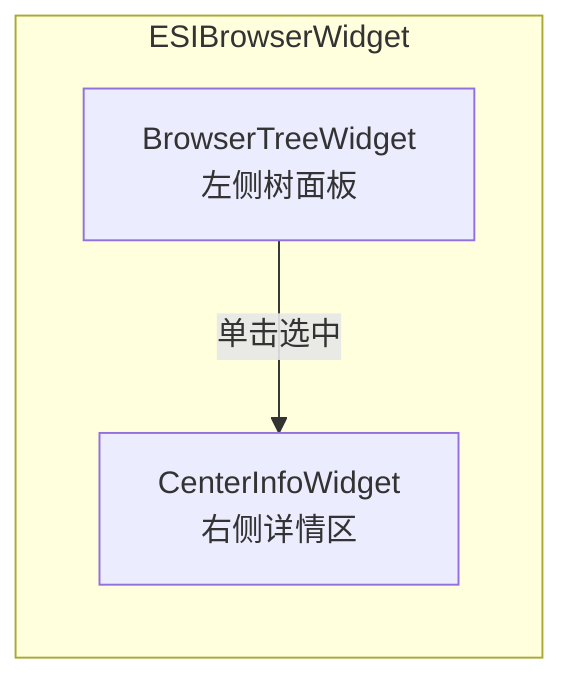

**BrowserTreeWidget（`layouts/ESIBrowserWidget/BrowserTreeWidget/`）**

| 状态 | 表现 |
|------|------|
| 空状态 | 文件夹图标 +「Open an ESI file to start」 |
| 加载中 | Canvas 旋转圆环遮罩 |
| 有数据 | `TreeView` + 节点计数；右侧 4px 拖拽手柄调宽度（240–450px） |
| `hasFile` | 绑定 `ESITreeModel.hasData`，非硬编码 |

**CenterInfoWidget（右侧详情）**

| 状态 | 内容 |
|------|------|
| 欢迎页 | Logo + 虚线拖拽区 + Browse Files / Load Example + 快捷键提示 |
| 详情页 | 面包屑 + Hero 区（节点类型徽章 + 名称）+ **属性卡片网格** + **Entry 表格**（PDO Entry / Object SubItem 等） |

详情数据来自树上选中节点的 `model.properties`（C++ 侧 `buildXxxProps()` 预先铺平），QML 按 `nodeType` 切换布局，无需在 QML 里再解析 XML。

---

### 8. 文件加载信号链

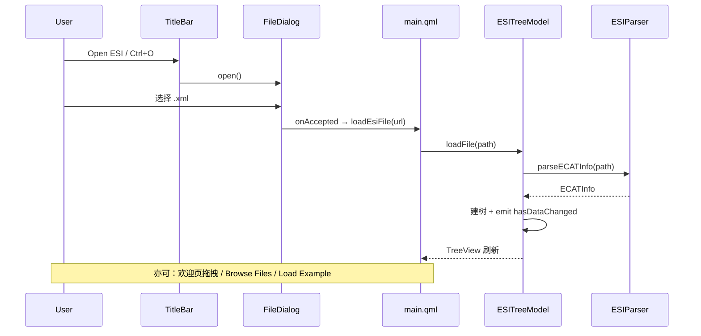

`loadEsiFile(url)` 统一处理 `file:///` 前缀、Windows 盘符、`.xml` 扩展名校验。

---

### 9. 多厂商实测样例

| 文件 | 厂商 | 根元素 | 特征 |
|------|------|--------|------|
| `test_esi/Copley_XE2_4.60.xml` | Copley | EtherCATInfo | 完整 SM/PDO/Dictionary/DC/Slots/ESC，~600KB |
| `test_esi/AKD_EtherCAT_Device_Description.xml` | Kollmorgen | EtherCATInfo | 多 Device 版本 + `<Exclude>` 互斥 PDO |
| `test_esi/Weidmueller_UR20_FBC.xml` | Weidmueller | EtherCATInfo | InfoReference、MailboxTimeout |
| `test_esi/Weidmueller_UR20_IO.xml` | Weidmueller | **EtherCATModule** | 298 个 Module，模块化 PDO |
| `test_esi/beckhoff/...` | Beckhoff | EtherCATInfo | 多语言 Name、HideType、大量 IO/耦合器 |

---

### 10. 与其他模块的关系

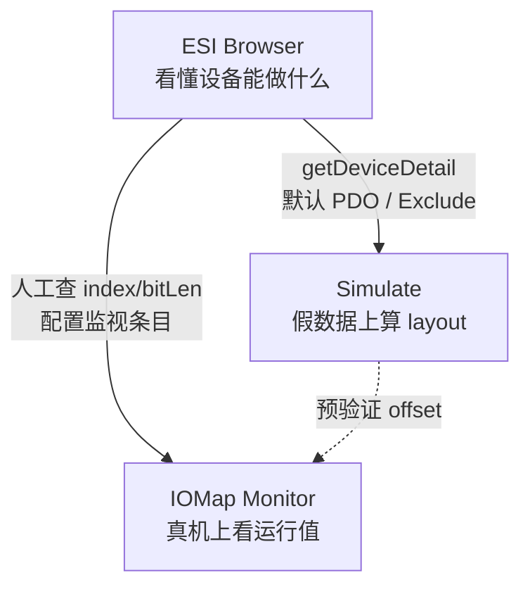

- **ESI Browser** 不直接参与 cyclic 通信；它是「字典」和「说明书」
- **Simulate** 从 ESI 拉默认 PDO 列表，在 PC 上预演过程映像和 LRW 帧
- **IOMap Monitor** 的 entry 配置（`0x6040`、`bitLen`、`byteOff`）应对齐 ESI + 真机实际映射；ESI 提供核对依据

---

### 11. 能力边界（ESI 模块）

| 已实现 | 未实现 |
|--------|--------|
| 流式解析两种根元素 | 在线 CoE 读从站（需真机） |
| 多文件加载、树浏览、详情面板 | ESI 编辑 / 保存 |
| 对象字典 Enum/Denotation 展示 | 全字段 100% 覆盖（见 §5） |
| `getDeviceDetail` 供仿真复用 | 自动从 ESI 一键生成 IOMap layout（需人工选 PDO 预设） |

---

## IOMap 远程联调监视 — 完整说明

本节说明从主站 cyclic 内存到 PC 面板显示的端到端逻辑。文中架构与协议均为 **本开源项目侧的设计与实现**；设备侧桥接层以通用模式描述，**不包含任何公司内部内核/驱动源码**。

### 1. 工具解决什么问题

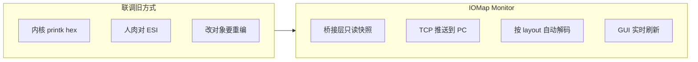

| 之前 | 之后 |
|------|------|
| `dmesg` 里翻 hex dump | 面板直接看「控制字 = 0x0006」「位置 = 1234」 |
| 多看一个 PDO entry 要改打印代码 | PC 端改从站/entry 配置即可 |
| 校验失败只能猜 | 帧头 `Obytes`/`Ibytes` 与本地 layout 自动比对，失败停收并打日志 |
| 监视工具绑死公司内部框架 | 开放 IOMT 协议 + 本仓库 PC 端实现，可对接任意 SOEM 桥接 |

---

### 2. 总体架构

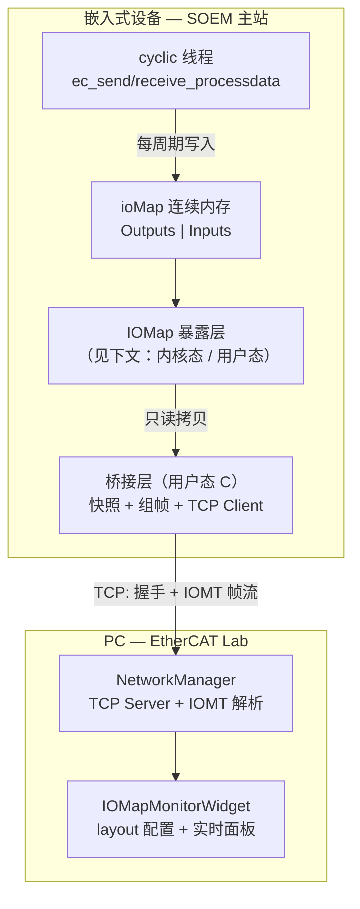

**角色分工：**

| 组件 | 所在位置 | 职责 |
|------|----------|------|
| SOEM cyclic | 设备 | 正常收发过程数据，更新 `ioMap` |
| IOMap 暴露层 | 设备（内核或用户态） | 把「当前过程映像」以**只读快照**方式交给桥接层 |
| 桥接层 | 设备用户态 | 双缓冲快照 → 封装 IOMT → TCP 发送；**不解析** 6040/607A 含义 |
| NetworkManager | PC | 监听、握手、粘包拆帧、校验、按 layout 解码 |
| IOMapMonitorWidget | PC | 配置物理链路顺序与 PDO entry → 生成 `Obytes/Ibytes/byteOff` |

---

### 3. SOEM 的 IOMap 是什么（为何本工具通用）

SOEM 在 `ec_config_map_group()` 之后，把所有从站的 **Outputs（主站→从站）** 和 **Inputs（从站→主站）** 拼进一块连续字节数组 `ioMap[]`：

```
ioMap 线性布局（与物理菊花链顺序一致）:

  ┌────────────────────────────────┬────────────────────────────────┐
  │  [0 .. Obytes-1]               │  [Obytes .. Obytes+Ibytes-1]   │
  │  全链 Outputs（RxPDO 数据）      │  全链 Inputs（TxPDO 数据）       │
  └────────────────────────────────┴────────────────────────────────┘
         Slave0_out | Slave1_out | ...        Slave0_in | Slave1_in | ...
```

- **顺序**：与线缆上的从站物理顺序严格一致（本工具 UI 中从站链顺序必须与此一致）。
- **含义**：`ioMap` 本身只是裸字节；`0x6040` 在第几个 byte 由 **PDO 映射配置** 决定，需一张 layout 表（本工具在 PC 侧配置，或从配置工具导出 JSON）。
- **通用性**：只要主站是 SOEM 且能拿到这块内存的快照，桥接层代码可复用，与具体伺服/IO 厂商无关。

---

### 4. IOMap 如何暴露给桥接层

桥接层运行在**用户态**，不能直接安全地「长期持有内核指针」，因此需要一层 **只读导出 API**。常见两种部署：

#### 4.1 用户态 SOEM 主站

```
┌─────────────────────────────────────┐
│  同一进程                            │
│  ioMap*  ──只读──►  桥接线程 memcpy   │
│  ec_send/receive 与 bridge 共享地址   │
└─────────────────────────────────────┘
```

- `ec_config_map_group` 之后，`ioMap` 指针在本进程有效。
- 桥接层**仅**在独立线程里对 `ioMap` 做 `memcpy` 快照，不修改 cyclic 逻辑。
- 最简单，无内核模块。

#### 4.2 内核态 SOEM 主站

```
┌──────────────────┐      只读导出 API       ┌──────────────────┐
│  内核 cyclic      │  ──────────────────►  │  用户态桥接层      │
│  ioMap 在内核内存  │   read/ioctl/mmap     │  拿到快照副本      │
└──────────────────┘                        └──────────────────┘
```

- `ioMap` 位于内核地址空间，用户态**不能**直接解引用内核指针。
- 典型做法（概念层，与具体产品实现无关）：
  - **字符设备只读接口**：用户态 `read()` / `ioctl` 取回固定长度快照；
  - **共享内存 + 序号**：内核写完后递增 generation，用户态读「上一帧完整快照」。
- 导出 API 必须 **只读、拷贝式**，避免桥接层与 cyclic 写竞争。

#### 4.3 用户态 vs 内核态暴露 — 对比

| 维度 | 用户态 SOEM | 内核态 SOEM |
|------|-------------|-------------|
| ioMap 位置 | 进程堆/全局数组 | 内核私有缓冲区 |
| 桥接层取数 | 直接 `memcpy(ioMap, snap, size)` | 通过设备节点/API 拷贝到用户缓冲 |
| 集成难度 | 低（同进程加线程） | 需额外导出模块，但 cyclic 隔离更好 |
| 实时性 | 取决于进程调度 | 内核侧更易与 cyclic 同步 |
| 本 PC 工具 | 无差别 — 只认 TCP 上的 IOMT 字节流 | 无差别 |

> **本 README 不描述任何公司内部字符设备名、ioctl 命令字或结构体布局。** 设备侧只需保证：桥接层能周期性拿到 **与 SOEM layout 一致的 `ioMapSize` 字节快照** 即可对接。

---

### 5. 双缓冲（避免读写打架）

cyclic 线程每个周期都在写 `ioMap`，桥接线程若直接读同一块内存，可能读到「半新半旧」数据。采用 **双缓冲快照**：

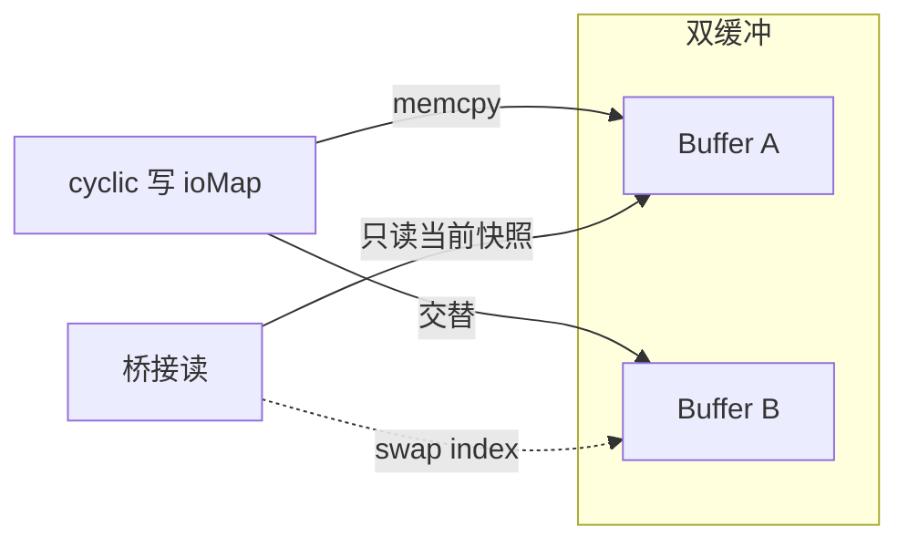

**典型实现（桥接层侧，与主站解耦）：**

```c
/* 示意 — 非公司代码 */
uint8_t snap[2][IOMAP_SIZE];
volatile int write_idx = 0;

void cyclic_hook_after_receive(void) {
    int w = write_idx;
    memcpy(snap[w], ioMap, IOMAP_SIZE);
    write_idx = 1 - w;          /* 发布新快照 */
}

void bridge_thread(void) {
    int r = 1 - write_idx;      /* 读刚写完的那块 */
    memcpy(tx_payload, snap[r], IOMAP_SIZE);
    send_iomt_frame(tx_payload);
}
```

要点：

- cyclic **只写** `ioMap` 和当前写缓冲；桥接 **只读** 非当前写缓冲。
- 也可用互斥锁保护单次 `memcpy`，但双缓冲无锁更易满足 cyclic 实时性。
- 内核态可在导出 API 内部完成同样逻辑，对用户态桥接返回的已是稳定快照。

---

### 6. TCP 发送什么：整包 = 协议头 + 完整 IOMap

**不是**发送 EtherCAT 线网上的 LRW 以太网帧。  
**不是**按从站拆成多个 TCP 包。  
**每个周期发送一帧 IOMT 消息**：

```
┌──────────────────────────────┬─────────────────────────────────┐
│  IOMT 协议头（固定 44 字节）   │  Payload（total_size 字节）      │
│  大端序                       │  = 完整 process image 快照       │
│                              │  [0..Obytes) outputs             │
│                              │  [Obytes..total) inputs          │
└──────────────────────────────┴─────────────────────────────────┘
```

即：**payload 就是当下整条菊花链的 IOMap 全量快照**，长度 = `Obytes + Ibytes`。

---

### 7. IOMT 协议头设计（44 字节）

Magic 为 ASCII **`IOMT`**（`0x494F4D54`）。实现见 `interfaces/networkmanager.h`。

| 偏移 | 长度 | 字段 | 说明 |
|------|------|------|------|
| 0 | 4 | `magic` | 固定 `0x494F4D54`（"IOMT"） |
| 4 | 4 | `version` | 协议版本，当前 `1` |
| 8 | 8 | `seq` | 单调递增序号，用于检测丢帧 |
| 16 | 4 | `total_size` | Payload 字节数，应等于 `Obytes + Ibytes` |
| 20 | 4 | `Obytes` | Outputs 区长度（与本地 layout 校验） |
| 24 | 4 | `Ibytes` | Inputs 区长度（与本地 layout 校验） |
| 28 | 4 | `layout` | 布局模式保留，当前填 `0` |
| 32 | 4 | `front_idx` | 当前帧在环网「前向」侧标记（可选，用于双网诊断） |
| 36 | 8 | `host_ts_ns` | 设备侧时间戳（纳秒，大端） |

**校验规则（PC 端）：**

1. `magic` / `version` 合法  
2. `total_size == Obytes + Ibytes`  
3. 实际收到的 payload 长度 == `total_size`  
4. `Obytes`、`Ibytes` 与 PC 上配置的从站链 layout **完全一致**，否则判失败、**停止接收但保持 TCP 连接**

---

### 8. 连接与握手流程

**拓扑**：PC 为 **TCP Server**（调试时人在 PC 前），设备桥接层为 **TCP Client** 主动连入。

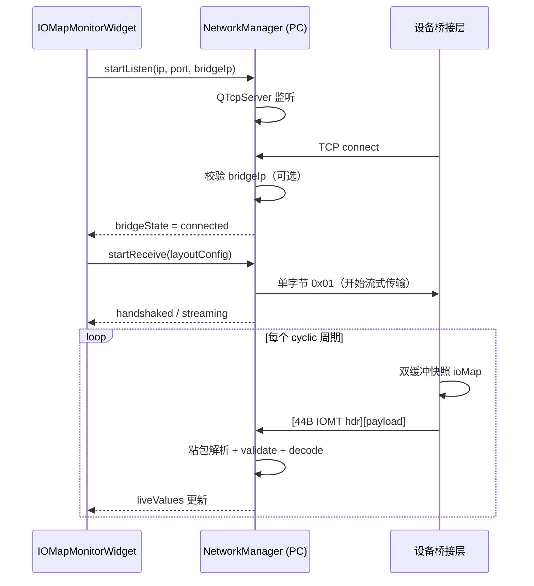

| 状态 | 含义 |
|------|------|
| `clientState`: idle → listening → connected → handshaked | PC 监听与握手进度 |
| `bridgeState`: disconnected → connected → handshaked → streaming | 设备连接与推流 |
| 用户点击「停止接收」 | 停止解码，**不断开** TCP，可再次开始接收 |
| 用户点击「断开」 | 关闭 socket 与监听 |

---

### 9. PC 端如何接收并显示

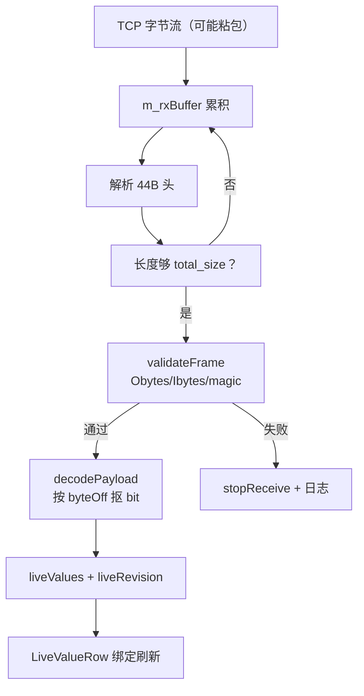

**Layout 配置（PC 侧）** — 与 Simulate 相同规则：

1. 按 **物理链路顺序** 添加从站（伺服 / IO）  
2. 伺服：配置 Rx/Tx PDO 各 entry 的 `index`、`bitLen`、`dataType`  
3. IO：配置 output/input 字节数  
4. `recomputeLayout()` 得到每个 entry 的 `byteOff` 及全局 `Obytes`、`Ibytes`、`total`  
5. `startReceive()` 时将该 layout 交给 `NetworkManager::buildDecodePlan()`

**解码**（与仿真引擎读过程映像同一套位运算）：

- 按 `byteOff` + `bitLen` 从 payload 取出数值  
- 伺服：显示 **hex + 十进制**（如 `0x6040:00 Control Word`）  
- IO：每字节显示 hex  

**UI 刷新**：`liveValues` 更新时递增 `liveRevision`，右侧 `ListModel` 整体刷新，避免 Repeater 不更新的问题。

---

### 10. 设备侧桥接层参考集成（SOEM）

以下为 **通用集成模式示意**，可独立为 ~150 行 C 库，**零 Qt 依赖**：

```c
/* 初始化：绑定快照来源与 PC 地址 */
bridge_init(get_iomap_snapshot, ioMapSize, "192.168.x.x", 9527, period_us);

/* 主循环不变 */
while (running) {
    ec_send_processdata();
    ec_receive_processdata(EC_TIMEOUTRET);
    /* 桥接内部线程已按 period 推帧，不阻塞 cyclic */
}
```

桥接层内部每周期：

1. 通过暴露 API / 双缓冲取得 `ioMap` 快照  
2. 填充 IOMT 头（`seq++`、`Obytes`、`Ibytes`、`total_size`）  
3. `send(TCP)` 一次发完 **44 + total_size** 字节  

---

### 11. 三模块如何配合（推荐工作流）

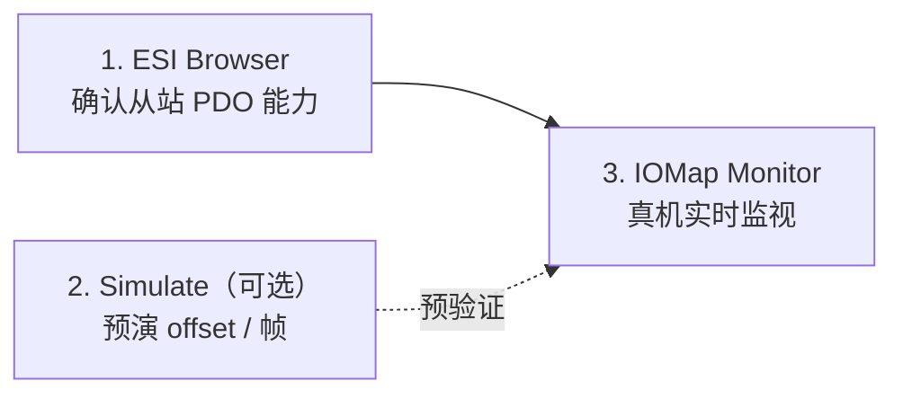

1. **ESI Browser**：查对象字典、默认 PDO、Exclude 互斥  
2. **Simulate**（可选）：在假数据上先算 layout，减少真机试错  
3. **IOMap Monitor**：按真机物理顺序配置同一套 layout → 连桥接层 → 实时看对象字  

---

## 系统架构（应用内）

### 分层总览

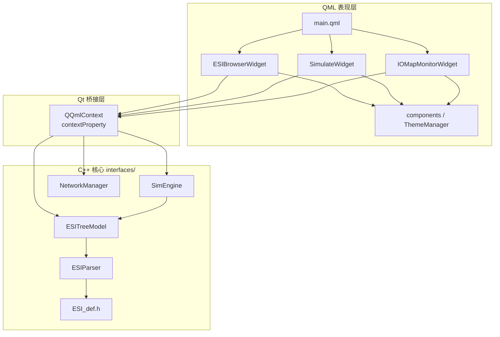

### 应用界面结构

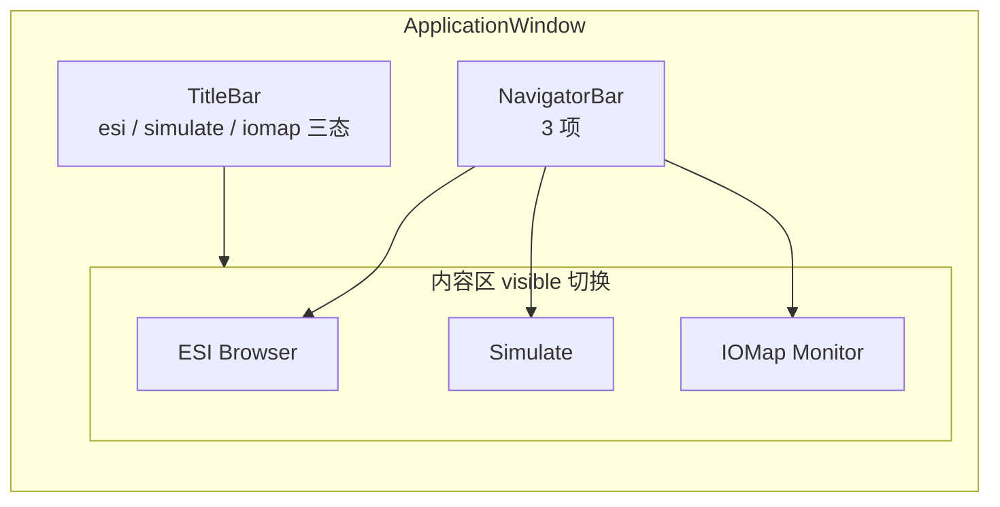

### 目录结构（简要）

```
Ethercat-Lab/
├── main.cpp
├── main.qml
├── EtherCAT-Lab.pro
├── interfaces/
│   ├── ESI_def.h
│   ├── esiparser.*
│   ├── esitreemodel.*
│   ├── simengine.*
│   └── networkmanager.*      # IOMT 协议 + TCP + 解码
├── layouts/
│   ├── ESIBrowserWidget/
│   ├── SimulateWidget/
│   ├── IOMapMonitorWidget/   # 从站链配置 + 实时监视
│   ├── NavigationBar/
│   ├── TitleBar/
│   └── components/
├── ui-prototype/
│   └── pdo-observer.html     # 交互原型（含 Mock 桥接）
├── docs/
│   └── Rio-Remote-IOMap-Observer-Design.md
├── resources/
├── test_esi/
└── CLAUDE.md
```

---

## 已验证 ESI 样例

详见上文 **[ESI Browser §9 多厂商实测样例](#9-多厂商实测样例)**。`test_esi/` 目录含 Copley、Kollmorgen AKD、Weidmueller、Beckhoff 等真实厂商 XML，用于验证解析器与树模型。

---

## 能力边界

| 已实现 | 未实现 / 非目标 |
|--------|----------------|
| **ESI**：两种根格式流式解析、树浏览、详情面板、多文件、`getDeviceDetail` | ESI 在线读取 / 编辑保存 |
| 仿真：拓扑、PDO layout、LRW 帧 | 网卡级 EtherCAT 发包 |
| IOMap：IOMT 协议、TCP 监视、entry 解码 | 邮箱 CoE 在线改映射 |
| 帧校验失败停收、桥接 IP 过滤 | 设备侧桥接层（在本仓库外独立集成） |
| | PDO 配置导出至固件（规划中） |

---

## 相关文档

| 文档 | 内容 |
|------|------|
| `docs/Rio-Remote-IOMap-Observer-Design.md` | Rio 方案背景、早期协议草案 |
| `ui-prototype/pdo-observer.html` | IOMap Monitor 可交互 HTML 原型 |
| `CLAUDE.md` | 构建命令、QML↔C++ 陷阱、ESI 解析约定 |
| `EtherCAT_Lab_评估与架构设计_QML版.md` | 项目整体架构设计 |

---

## License

未指定开源许可证；使用前请联系作者或仓库维护者。
