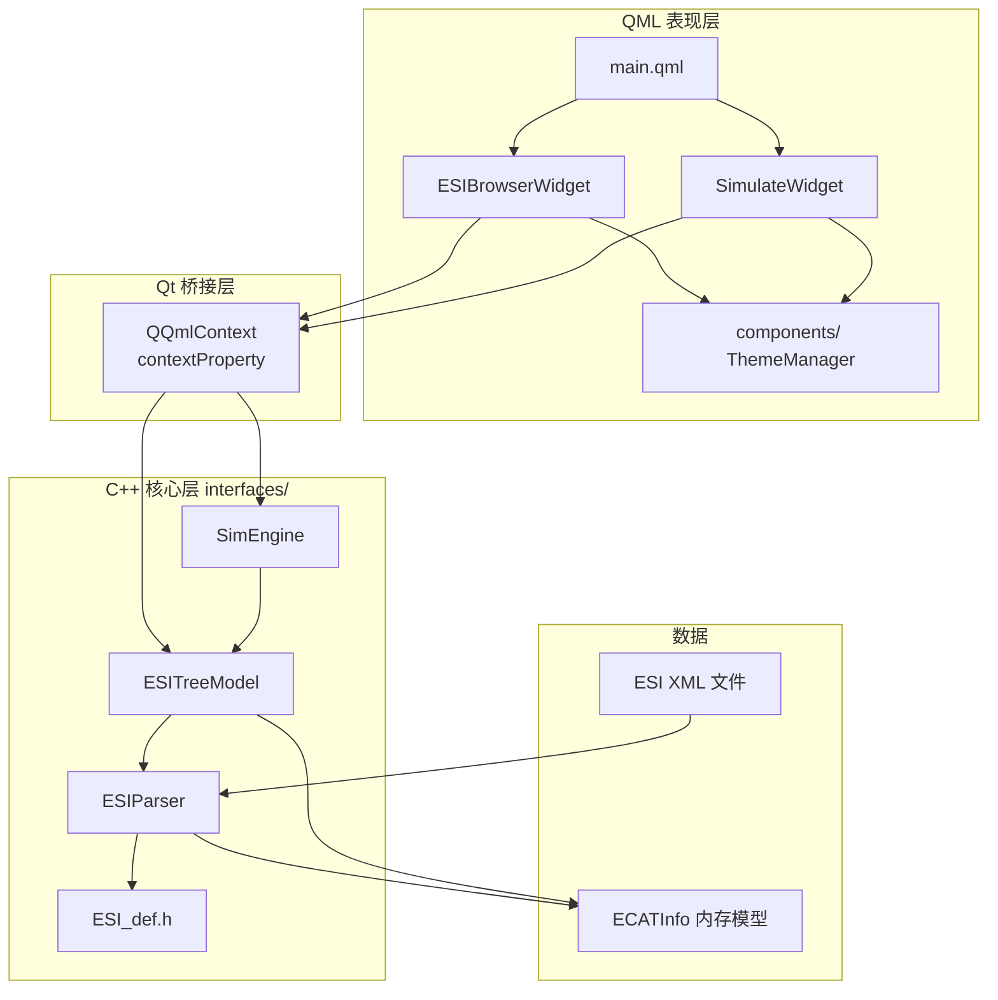
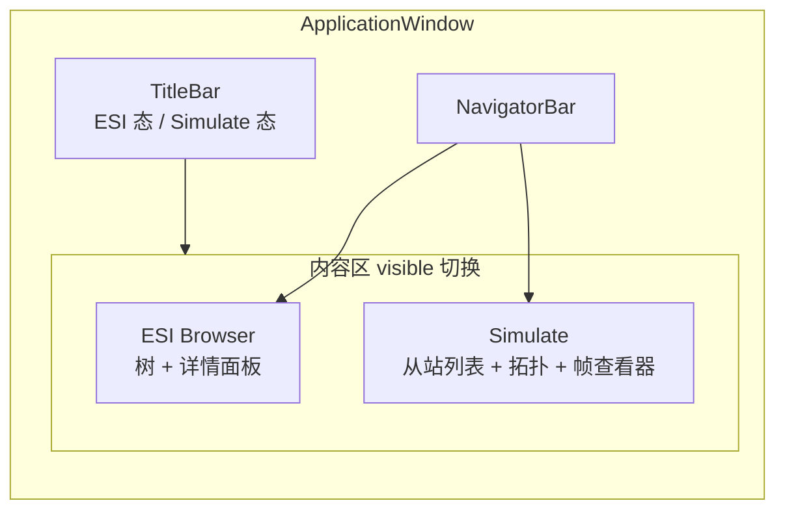
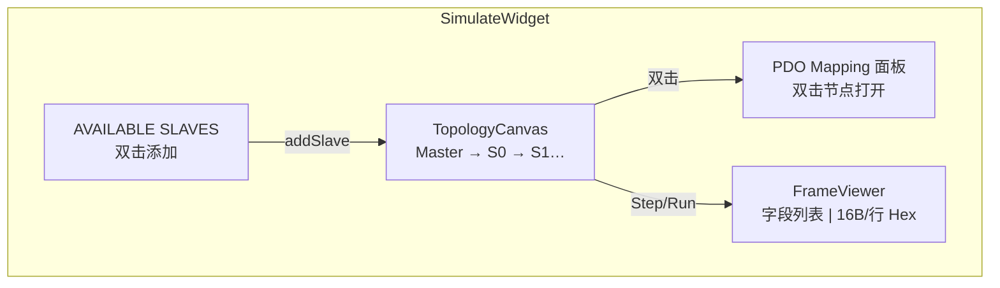
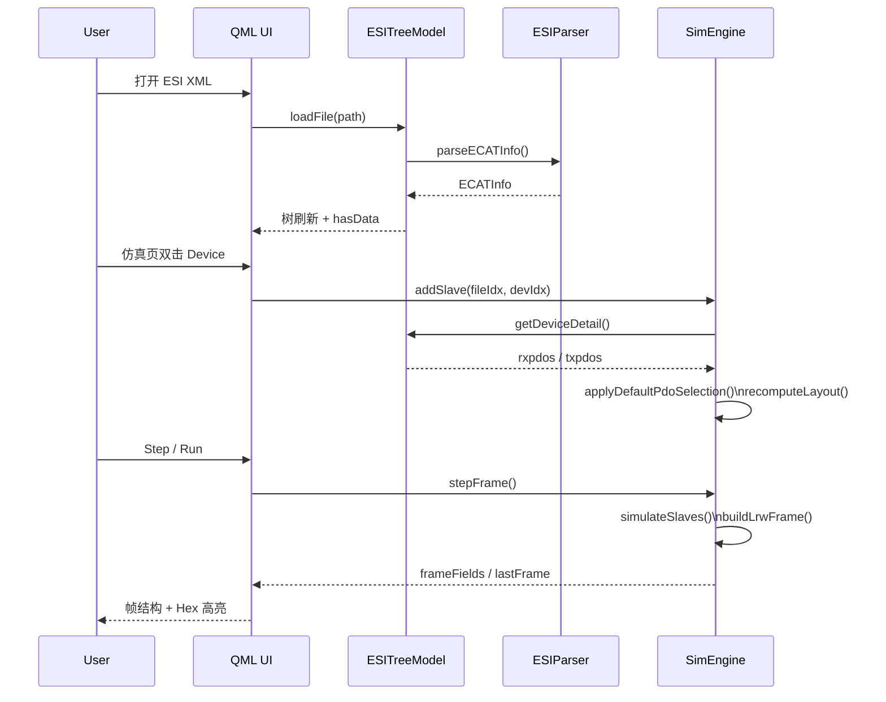

# EtherCAT Lab

基于 EtherCAT 主站联调场景开发的 **Qt 可视化配置辅助工具**，用于 ESI 预解析、PDO 映射预配置与 cyclic 过程映像校验，在真机调试前发现映射错误，缩短多厂商从站（伺服 / IO）的集成周期。

---

## 技术栈

| 类别 | 说明 |
|------|------|
| **语言** | C++17 |
| **UI 框架** | Qt **6.5.3**（MinGW 64-bit 套件） |
| **界面** | Qt Quick / **QML** + Qt Quick Controls 2（Fusion 风格） |
| **构建** | **qmake**（`EtherCAT-Lab.pro`，非 CMake） |
| **XML** | `QXmlStreamReader` 流式解析 ESI |
| **平台** | 主要面向 Windows；Qt 6 跨平台，Linux/macOS 需自备对应套件 |

### QML 与 C++ 如何协作

本项目采用 **C++ 业务逻辑 + QML 界面** 的混合架构：

1. **C++ 单例** 在 `main.cpp` 中创建，通过 `QQmlContext::setContextProperty` 注入 QML 全局：
   - `ESITreeModel` — ESI 解析、树模型、设备列表
   - `SimEngine` — 仿真从站链、PDO 布局、LRW 帧生成
2. **QML** 直接绑定 `ESITreeModel.hasData`、`SimEngine.slaveCount` 等 `Q_PROPERTY`，调用 `Q_INVOKABLE` 方法（如 `loadFile()`、`addSlave()`、`stepFrame()`）。
3. **资源** 通过 `qml.qrc` / `resources.qrc` 打包 QML 与 SVG 图标；入口为 `qrc:/main.qml`。
4. **主题** 由 QML 单例 `ThemeManager` + `ThemeConfig.js` 驱动，组件统一绑定颜色属性。

```
main.cpp
  └─ QQmlApplicationEngine
        ├─ contextProperty: ESITreeModel  ←→  ESIBrowserWidget（树 / 详情）
        ├─ contextProperty: SimEngine      ←→  SimulateWidget（拓扑 / PDO / 帧）
        └─ load("qrc:/main.qml")
```

---

## 编译与运行

### 环境要求

- **Qt 6.5.3**，组件：Qt Quick、Qt Quick Controls 2、Qt XML
- 编译器：**MinGW 64-bit**（与 Qt 6.5.3 套件匹配）
- 推荐 IDE：**Qt Creator**，选择套件 `Desktop Qt 6.5.3 MinGW 64-bit`

### 命令行构建（Windows）

在 **Qt 6.5.3 MinGW 64-bit** 命令行环境中，于项目根目录执行：

```bash
qmake EtherCAT-Lab.pro
mingw32-make
```

- **Release** 产物：`release/EtherCAT-Lab.exe`
- **Debug** 构建：`mingw32-make debug` → `debug/EtherCAT-Lab.exe`

### Qt Creator

1. 打开 `EtherCAT-Lab.pro`
2. 配置套件 **Desktop Qt 6.5.3 MinGW 64-bit**
3. 构建并运行（Ctrl+R）

> 若使用 Qt Creator 的 Shadow Build，可执行文件位于  
> `build/Desktop_Qt_6_5_3_MinGW_64_bit-Debug/` 或对应的 Release 目录。

### 快速试用

1. 启动程序，默认进入 **ESI Browser** 页
2. **Open ESI** / **Ctrl+O** / 拖放，加载 `test_esi/` 下的 XML，例如：
   - `Copley_XE2_4.60.xml`
   - `AKD_EtherCAT_Device_Description.xml`
   - `Weidmueller_UR20_FBC.xml`
3. 切换到 **Simulate** 页：左侧双击 Device 加入拓扑 → 双击拓扑节点打开 PDO 面板 → 标题栏 **Step / Run** 生成帧 → 底部帧查看器 **双击左侧字段** 高亮右侧 hex

---

## 项目简介

实习期间参与 EtherCAT 主站驱动开发：Qt 配置 PDO 映射 → 生成自定义配置文件 → 固件 / 内核侧按 offset 加载。联调中频繁遇到 **ESI 描述与实际上线配置不一致**、**PDO 互斥关系理解偏差**、**过程映像 offset 算错** 等问题，真机排错成本高。

**EtherCAT Lab** 将上述联调流程前置到 PC 侧完成预验证：

| 模块 | 作用 |
|------|------|
| **ESI Browser** | 流式解析多厂商 ESI，浏览对象字典、Sync Manager、PDO Entry 等完整从站能力描述 |
| **Simulate** | 按菊花链拓扑组从站，配置 Rx/Tx PDO 映射，计算过程映像 byte/bit offset，生成 LRW cyclic 帧 |
| **帧查看器** | 字段级协议标注 + 16 字节/行 hex，双击字段定位对应字节，核对映射与线上一致性 |

**定位**：主站集成辅助工具（预配置 / 预验证），非 TwinCAT / IgH 替代实现。  
已支持 `<Exclude>` PDO 互斥、模块化 ESI（Slots/Modules）、CiA 402 过程数据演示；PDO 配置导出对接固件为后续方向。

---

## 系统架构

### 分层总览



### 应用界面结构



**Simulate 页布局：**



### 核心数据流



### 目录结构（简要）

```
Ethercat-Lab/
├── main.cpp                 # 入口，注册 C++ 单例到 QML
├── main.qml                 # 主窗口、页面切换
├── EtherCAT-Lab.pro         # qmake 工程文件
├── interfaces/              # C++ 核心
│   ├── ESI_def.h            # ESI 数据模型 struct
│   ├── esiparser.*          # XML 解析器
│   ├── esitreemodel.*       # 树模型 + QML 接口
│   └── simengine.*          # 仿真引擎
├── layouts/                 # QML 界面
│   ├── ESIBrowserWidget/
│   ├── SimulateWidget/
│   ├── NavigationBar/
│   ├── TitleBar/
│   └── components/          # 通用组件 + ThemeManager
├── resources/               # SVG 图标
├── test_esi/                # 测试用 ESI 样例
├── qml.qrc / resources.qrc
└── CLAUDE.md                # 开发备忘（构建、陷阱、约定）
```

---

## 已验证 ESI 样例

| 文件 | 厂商 | 说明 |
|------|------|------|
| `test_esi/Copley_XE2_4.60.xml` | Copley | 模块化 Slots + Modules |
| `test_esi/AKD_EtherCAT_Device_Description.xml` | Kollmorgen | 多 Device 版本 + Exclude 互斥 PDO |
| `test_esi/Weidmueller_UR20_FBC.xml` | Weidmueller | 多 Device / InfoReference |
| `test_esi/beckhoff/...` | Beckhoff | 大量 IO/伺服 ESI |

---

## 仿真能力说明

- **已实现**：从站链拓扑、PDO 启用/互斥、过程映像布局、LRW 帧构造与字段标注、402 伺服过程数据演示——用于联调前映射预验证
- **未实现**：状态机、邮箱 CoE、DC、真实 WKC、网卡发包、PDO 配置导出至固件（与实习方案衔接中）

---

## 相关文档

- `CLAUDE.md` — 构建命令、QML↔C++ 陷阱、ESI 解析约定
- `EtherCAT_Lab_评估与架构设计_QML版.md` — 完整架构设计（v2.0）

---

## License

未指定开源许可证；使用前请联系作者或仓库维护者。
